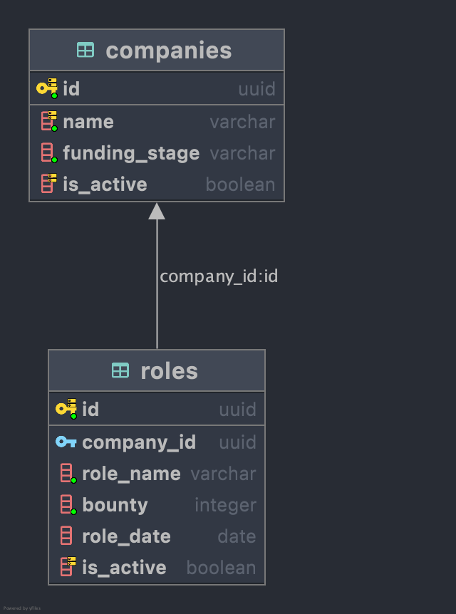

# Technical Talentdrop

## Database Layout


## How To Run
### Initial Setup
**Docker Desktop** makes managing running images easy with a UI. View/Stop/Start/Delete running, dormant, and previously
run containers with the UI.
- Install **[Docker Desktop](https://www.docker.com/products/docker-desktop)** on your local machine
- Make an account (_it's free!_) on [Docker Hub](https://hub.docker.com/signup)

### Run Project
These instructions are the most commonly used to RUN this Dockerfile. Use **Docker Desktop** to terminate/view running
containers.

#### RUN
Replace **both** `<foo>` tags with a name (no spaces, best to use `-` and lowercase chars) of your choosing.
 
1. Copy `.env` file to root directory (next to `main.py`) or make it yourself. Copy this line--replace URL with your desired PostgeSQL link:
   1. ```dotenv
      DB_URI=postgresql://<USER>:<PASSWORD>@<HOST>:<PORT>/<DATABASE>
      ```
      :bangbang: **Do not remove `postgresql://`** :bangbang:


2. `docker build -t <foo> . && docker run -p 80:80 -it <foo>`
   1. _Example_: `docker build -t test-tdrop . && docker run -p 80:80 -it test-tdrop`
3. Open your browser and navigate to: `0.0.0.0:80/docs` to test the backend.
 

## Use the API
Once the Docker container is successfully running, navigate to the [URL](http://0.0.0.0:80/docs) above to an interactive
UI to test the endpoints and view the returns.

Docker container also serves up another documentation page at http://0.0.0.0:80/redoc (not interactive).


# About
This project is connected to a Heroku PostgeSQL database. Any remote PostgreSQL database works, just change the URL to your service.